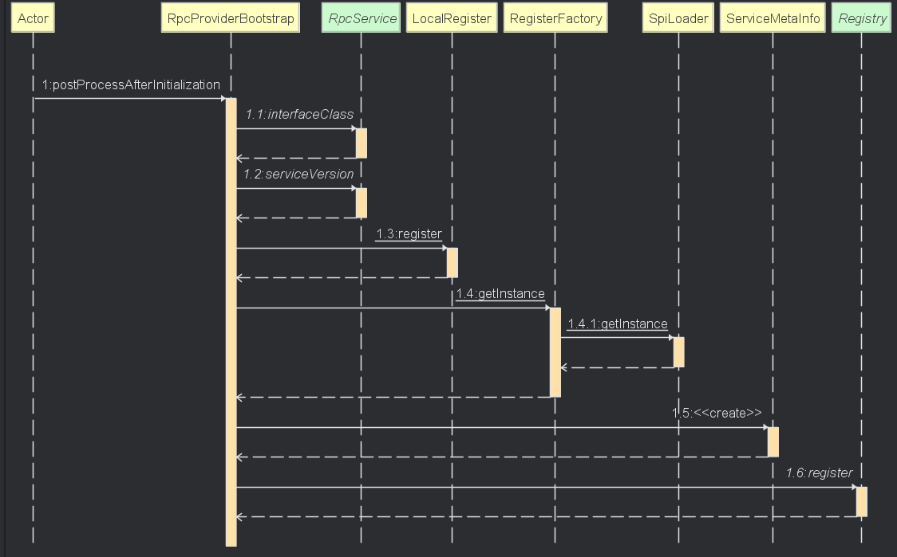
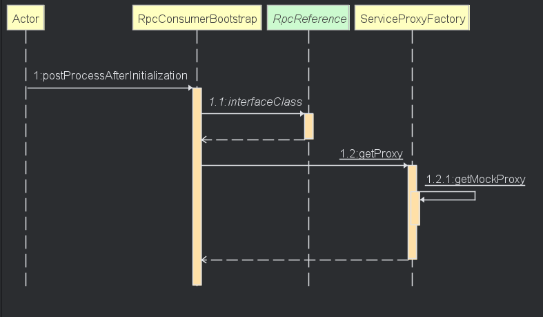

# Easy-RPC

## 项目介绍:new:

一款基于 **Java + Etcd + Vert.x** 实现的轻量级远程调用框架。

项目功能：

- :fire: 自定义基于 TCP 的应用层协议进行通信，提升了网络传输性能
- :star2: 基于注解驱动的 **Spring Boot Starter**，通过注解即可快速注册 Bean 为服务、以及注入服务调用代理对象
- :heart: 通过扫描资源路径 + 反射实现了 **SPI 机制**，可通过编写配置的方式**拓展**和指定序列化器、注册中心、重试机制等
- :mortar_board: 支持多种序列化方式、重试机制、负载均衡算法、注册中心等

## 目录结构:straight_ruler:

| 目录                         | 描述                                   |
| ---------------------------- | -------------------------------------- |
| easy-rpc-core                | rpc 核心实现                           |
| example-common               | 接口示例                               |
| example-consumer             | easy-rpc-core的原生服务消费者使用示例  |
| example-provider             | easy-rpc-core的原生服务提供者使用示例  |
| example-springboot-consumer  | 基于 SpringBoot 封装后的消费者使用示例 |
| example-springboot-provider  | 基于 SpringBoot 封装后的提供者使用示例 |

## 核心流程:first_quarter_moon:

### 服务注册



- 通过重写`BeanPostProcessor`的`postProcessAfterInitialization`，对**Spring Ioc**容器的每个Bean进行检查，如有自定义的`RpcService`注解，进行接下来的流程
- 在本地注册中心`LocalRegister`进行注册，给服务方自己使用，后续接收消费者消息时，从本地获取要调用的实现类
- 生成服务实现的元信息，并向远程注册中心`Registry`进行注册，给消费者使用，获取服务地址

### 服务消费



- 通过重写`BeanPostProcessor`的`postProcessAfterInitialization`，对**Spring Ioc**容器的每个Bean的属性进行检查，如果属性上有自定义的`RpcReference`注解，获取代理对象并注入到这个属性

## 使用:tada:

1. 导入依赖

```xml
<dependency>
    <groupId>io.github.laterya</groupId>
    <artifactId>easy-rpc-core</artifactId>
    <version>1.0.0</version>
</dependency>
```

2. 服务提供者

启动类上使用`@EnableRpc`注解

```java
@SpringBootApplication
@EnableRpc
public class ExampleSpringbootProviderApplication {

    public static void main(String[] args) {
        SpringApplication.run(ExampleSpringbootProviderApplication.class, args);
    }

}
```

具体实现使用`@RpcService`注解

```java
@Service
@RpcService
public class UserServiceImpl implements UserService {
    @Override
    public User getUser(User user) {
        User user1 = new User();
        user1.setName("来自SpringBoot-Provider的实现" + user.getName());
        return user1;
    }
}
```

3. 服务消费者

启动类上使用`@EnableRpc(needServer = false)` 注解（Server是服务提供者需要开启的，而消费者不需要，默认开启，需要关闭）

```java
@SpringBootApplication
@EnableRpc(needServer = false)
public class ExampleSpringbootConsumerApplication {

    public static void main(String[] args) {
        SpringApplication.run(ExampleSpringbootConsumerApplication.class, args);
    }

}
```

消费者进行使用，需要注意的是只有在SpringIOC容器管理的Bean中才可以使用注解进行 RPC 使用

```java
@Service
public class ExampleServiceConsumer {

    @RpcReference
    private UserService userService;
    
    public void test() {
        User user = new User();
        user.setName("laterya");
        User user1 = userService.getUser(user);
        System.out.println(user1.getName());
    }
}
```

